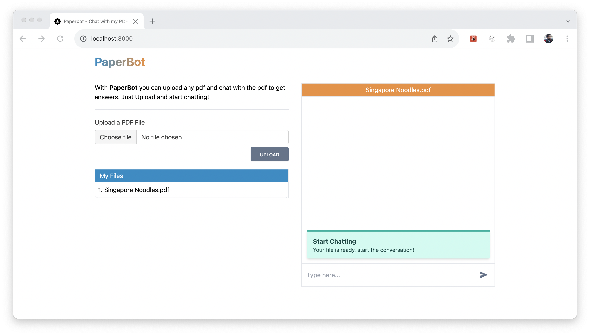

# BottyRead

Chat with your PDF files using BottyRead! This application allows you to upload PDF files, process them, and engage in a chat conversation based on the content of the PDF.

## Overview

BottyRead utilizes various technologies to enable PDF-based chat:

- **Frontend**: Next.js, React, TailwindCSS
- **Backend**: Next.js Server Side Rendering, Node.js
- **Database**: MongoDB for user data and Supabase for note-taking
- **External Services**: OpenAI for embedding and completion models, Pinecone for vector database, Clerk for Authentication
- **Cloud Storage**: AWS S3 for file storage

## Features

- Upload PDF files and process them for chat interaction
- Semantic search on Pinecone Vector database for answering questions
- OpenAI embedding model for generating embeddings
- OpenAI completion model for refining search results
- File data (Slug, index and url) stored in MongoDB
- Note-taking functionality with Supabase
- User authentication using Clerk

## Prerequisites

Before running the project, ensure you have the following:

1. OpenAI API Key
2. Pinecone Database ENV and KEY
3. MongoDB cluster username and password
4. AWS S3 bucket, access key, and access id
5. Supabase URL and ANON key
6. Clerk Secret Key

## Setup

Follow these steps to set up and run the project:

1. Clone the repository
2. Run `npm install` to install dependencies
3. Create a `.env.local` file from `env-example`: `cp env-example .env.local`
4. Update the OpenAI, Pinecone keys, MongoDB credentials, AWS S3 bucket, Supabase and Clerk details in `.env.local`
5. Run `npm run dev` to start the project

## Tech Stack

- Next.js
- React
- TailwindCSS
- MongoDB
- Pinecone (Vector DB)
- OpenAI Models - Embedding and Completion
- Supabase
- Clerk

## Contact

For any inquiries or support, please contact anirban.chk1@gmail.com.
